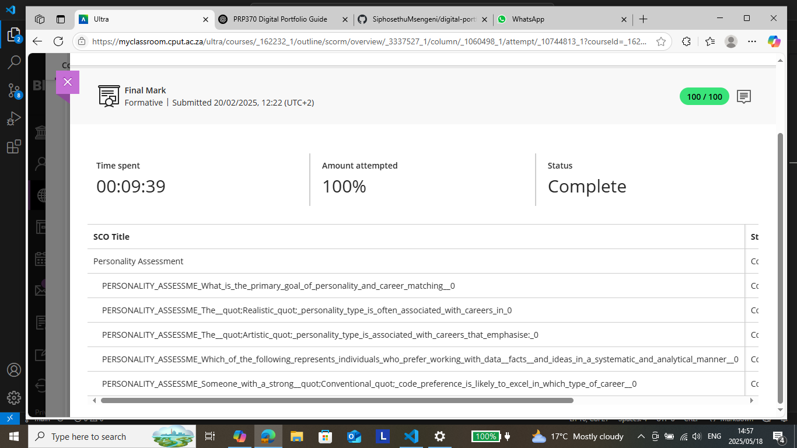

# Personality Assessment Evidence

## **Assessment Summary**
- **Date Completed:** 20 February 2025
- **Score:** 100 out of 100
- **Duration:** 9 minutes and 39 seconds
- **Completion Status:** Full attempt recorded

## **Key Findings**
This assessment explored various personality types and career alignments. The key insights include:
- **Realistic personality type:** Best suited for problem-solving and structured work environments.
- **Artistic personality type:** Aligns with creative professions requiring innovation.
- **Conventional personality type:** Matches structured, methodical career paths.
- Preference for **working with data, facts, and analytical approaches**, reinforcing my interest in backend development and system architecture.

## **Supporting Artifact**

## **Conclusion**
The results affirm my **analytical, detail-oriented approach**, guiding my focus toward **backend development, database design, and structured programming methodologies**.