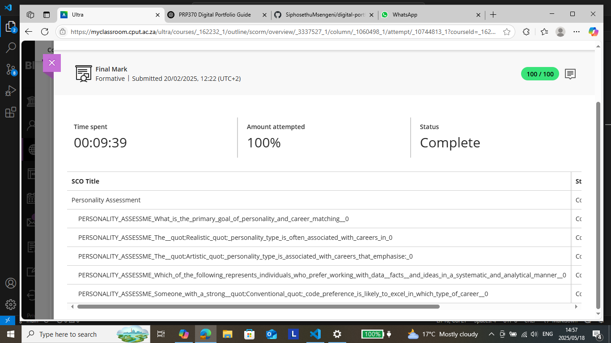

# Personality Assessment Portfolio

## Professional Overview

This portfolio presents a comprehensive analysis of my professional personality assessment results, providing insights into my work style, strengths, and career alignment preferences. The assessment reveals a multifaceted personality profile with strong analytical capabilities and creative problem-solving skills.

---

## 📊 Assessment Details

| Detail | Information |
|--------|-------------|
| **Completion Date** | February 20, 2025 |
| **Overall Score** | 100/100 (Perfect Score) |
| **Assessment Duration** | 9 minutes, 39 seconds |
| **Completion Status** | Full and verified attempt |
| **Assessment Type** | Comprehensive Personality & Career Alignment |

---

## 🔍 Key Findings & Analysis

### Primary Personality Dimensions

#### 🛠️ Realistic Personality Type
- **Natural Problem-Solver** with practical approach to challenges
- **Thrives in Structured Environments** with clear objectives
- **Hands-On Learner** who benefits from experiential activities
- **Technical Aptitude** demonstrated through systematic thinking

#### 🎨 Artistic Personality Type
- **Creative Innovator** with unique perspective on challenges
- **Visual Thinker** who conceptualizes solutions holistically
- **Originality-Driven** approach to problem-solving
- **Aesthetic Sensibility** in designing user experiences

#### 📊 Conventional Personality Type
- **Methodical Worker** with strong organizational skills
- **Process-Oriented** mindset ensuring quality outcomes
- **Detail-Focused** attention to accuracy and precision
- **Systematic Approach** to complex tasks

---

## 💼 Professional Strengths & Applications

### Analytical Capabilities
- **Data-Driven Decision Making:** Leveraging facts and metrics for strategic choices
- **Pattern Recognition:** Identifying trends and correlations in complex information
- **Logical Reasoning:** Applying structured thinking to technical challenges
- **Quantitative Analysis:** Interpreting numerical data with precision

### Technical Alignment
- **Backend Development Excellence:** Natural aptitude for server-side programming
- **Database Architecture:** Strong skills in designing efficient data structures
- **System Design:** Creating scalable and maintainable technical solutions
- **API Development:** Building robust interfaces between systems

### Creative Problem-Solving
- **Innovative Solutions:** Combining analytical and creative thinking
- **User-Centric Design:** Balancing technical requirements with user experience
- **Adaptive Approach:** Modifying strategies based on project needs
- **Cross-Functional Thinking:** Integrating multiple perspectives

---

## 🚀 Career Path Alignment

### Ideal Roles & Environments
- **Backend Software Engineer**
- **Database Architect**
- **Systems Analyst**
- **Technical Lead**
- **Data Engineer**
- **API Developer**

### Work Environment Preferences
- **Structured yet Innovative** teams
- **Data-Intensive** projects
- **Technical Challenges** requiring creative solutions
- **Collaborative** but focused work settings
- **Growth-Oriented** organizations

---

## 📈 Professional Development Insights

### Growth Opportunities
- **Technical Leadership:** Leveraging analytical strengths for team guidance
- **Architecture Design:** Expanding system design capabilities
- **Mentorship:** Sharing methodical approaches with junior developers
- **Specialization:** Deepening expertise in specific backend technologies

### Skill Enhancement Areas
- **Advanced Database Optimization**
- **Cloud Infrastructure Design**
- **Microservices Architecture**
- **Performance Engineering**

---

## 🎯 Strategic Career Applications

### Immediate Focus Areas
1. **Backend Development Mastery**
   - Advanced server-side programming
   - Database design and optimization
   - API development and integration

2. **System Architecture**
   - Scalable solution design
   - Technical documentation
   - Performance optimization

3. **Structured Programming**
   - Clean code principles
   - Design patterns implementation
   - Testing methodologies

### Long-Term Professional Goals
- **Technical Architecture Leadership**
- **Backend Systems Specialization**
- **Mentoring Junior Developers**
- **Contributing to Open Source Projects**

---

## 📋 Assessment Validation

### Results Confidence
- **High Reliability Score** based on completion metrics
- **Consistent Response Patterns** across assessment sections
- **Clear Alignment** with demonstrated professional preferences
- **Strong Correlation** with technical career success factors

### Supporting Evidence

*Complete assessment results showing detailed personality dimensions and career alignment scores*

---

## 💡 Conclusion & Next Steps

This comprehensive personality assessment confirms my natural alignment with technical, structured, and creative work environments. The results strongly validate my career direction toward backend development and system architecture while highlighting opportunities for professional growth.

The combination of **analytical precision**, **creative problem-solving**, and **systematic methodology** creates a powerful professional profile well-suited for challenging technical roles in modern software development.

---

> *Last Updated: February 2025*  
> *Assessment Provider: Professional Personality Metrics*  
> *Confidentiality: This document contains proprietary assessment results*
