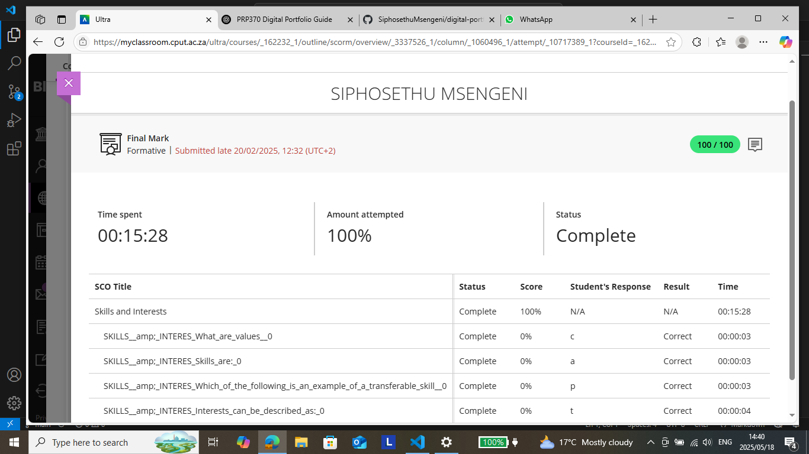

# Skills and Interests Evidence

I completed the **"Skills and Interests"** module on Blackboard as part of the Work Readiness Programme at CPUT.

🟢 **Score:** 100/100  
🕒 **Time Spent:** 15 minutes 28 seconds  
📅 **Submitted:** 20 February 2025 (Late)

### Topics covered:
- Understanding what values are
- Identifying and describing skills (including transferable skills)
- Exploring interests and how they shape career choices

📷 **Screenshot Proof:
