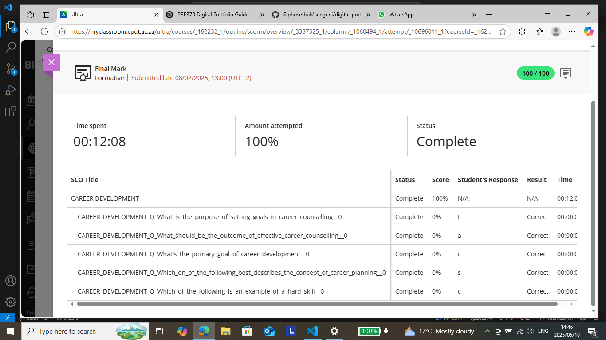

# Career Counselling Evidence

As part of my Work Readiness Programme at CPUT, I completed an online module titled **"Career Development"** via Blackboard. The module covered:

- The importance of setting career goals
- The outcomes of effective career counselling
- The purpose and planning involved in career development
- Understanding hard vs. soft skills

🟢 **Score:** 100/100  
🕒 **Time Spent:** 12 minutes  
📅 **Submitted:** 8 February 2025

This module gave me a solid foundation in setting goals and planning a career path aligned with my strengths and interests.
